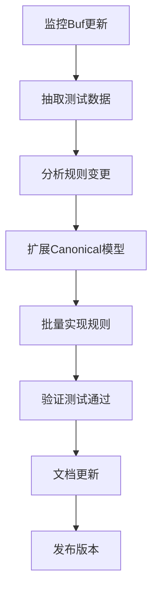

# Buf项目同步开发指南

## 概述

本文档详细阐述如何跟进上游Buf项目的更新，保持proto-sign与Buf breaking change检测规则的1:1同步。适用于需要维护和扩展proto-sign项目的开发者。

## 目录

- [概述](#概述)
- [同步流程概览](#同步流程概览)
- [详细操作步骤](#详细操作步骤)
- [技术架构说明](#技术架构说明)
- [实施经验总结](#实施经验总结)
- [故障排查指南](#故障排查指南)
- [开发最佳实践](#开发最佳实践)

## 同步流程概览



### 核心原则

1. **严格1:1复刻** - 规则ID、语义、分类、默认启用状态完全一致
2. **测试数据同源** - 使用Buf官方testdata，确保验证准确性
3. **模块化架构** - 按类别组织规则，便于维护和扩展
4. **自动化验证** - 通过测试确保规则完整性和正确性

## 详细操作步骤

### 1. 监控Buf项目更新

#### 1.1 关键监控点

**主要仓库：**
- 🔗 https://github.com/bufbuild/buf

**核心文件监控：**
```bash
# 规则定义和元数据
buf/private/bufpkg/bufcheck/rule.go
buf/private/bufpkg/bufcheck/category.go

# 规则装配和构建
buf/private/bufpkg/bufcheck/bufcheckserver/internal/bufcheckserverbuild/
buf/private/bufpkg/bufcheck/bufcheckserver/internal/bufcheckserverhandle/

# 测试数据
buf/private/bufpkg/bufcheck/testdata/breaking/
```

#### 1.2 版本跟踪策略

```bash
# 设置Buf仓库监控
git clone https://github.com/bufbuild/buf.git /d/proto/buf-upstream
cd /d/proto/buf-upstream

# 定期检查更新
git fetch origin
git log --oneline --since="1 week ago" -- private/bufpkg/bufcheck/

# 查看breaking规则相关提交
git log --grep="breaking" --grep="rule" --since="1 month ago"
```

### 2. 抽取和更新测试数据

#### 2.1 使用现有脚本

我们已有完整的测试数据抽取脚本：

```bash
# 位置：proto-sign/compat-configs/extract_buf_configs.sh
cd /mnt/sdb1/proto/proto-sign/compat-configs

# 抽取最新版本数据
./extract_buf_configs.sh

# 抽取特定版本
./extract_buf_configs.sh --branch v1.28.0

# 验证抽取结果
find extracted/testdata -name "*.proto" | wc -l  # 应有约315个文件
```

#### 2.2 测试数据验证

```bash
# 检查测试目录结构
ls -la extracted/testdata/current/breaking_* | head -10

# 验证current/previous对应关系
diff -r extracted/testdata/current/breaking_field_no_delete \
        extracted/testdata/previous/breaking_field_no_delete
```

### 3. 分析规则变更

#### 3.1 规则变更检测

创建分析脚本来检测新增或变更的规则：

```bash
# 在buf仓库中查找所有规则定义
cd /d/proto/buf-upstream
grep -r "RuleID.*=" private/bufpkg/bufcheck/ | grep -v test

# 与现有规则对比
cargo test test_bulk_rule_verification -- --nocapture | \
    grep -A 100 "规则验证通过" > current_rules.txt
```

#### 3.2 规则分类分析

根据Buf源码分析新规则应归属的类别：

```go
// 文件级规则
FILE_*

// 字段级规则  
FIELD_*

// 消息级规则
MESSAGE_*

// 枚举级规则
ENUM_*

// 服务级规则
SERVICE_*, RPC_*

// 保留字段规则
RESERVED_*

// 包级规则
PACKAGE_*

// 扩展规则
EXTENSION_*

// 特殊规则
SYNTAX_*, IMPORT_*
```

### 4. 扩展Canonical模型

#### 4.1 模型扩展原则

新规则如果需要额外的protobuf信息，必须先扩展`src/canonical.rs`：

```rust
// 示例：添加新的文件选项
#[derive(Debug, Default, Serialize, PartialEq, Eq, PartialOrd, Ord)]
pub struct CanonicalFile {
    // 现有字段...
    
    // 新增字段（总是使用Option包装）
    #[serde(skip_serializing_if = "Option::is_none")]
    pub new_file_option: Option<String>,
}
```

#### 4.2 Normalize函数更新

同步更新`src/normalize.rs`中的字段提取逻辑：

```rust
// 在normalize_file_descriptor函数中添加
canonical_file.new_file_option = file_descriptor
    .options()
    .and_then(|opts| opts.get_extension_opt(/* extension_id */))
    .map(|value| value.to_string());
```

### 5. 批量实现规则

#### 5.1 选择实现策略

根据规则类型选择合适的实现模式：

**宏生成模式** - 适用于同类型重复规则：
```rust
// 在src/compat/bulk_file_rules.rs中
generate_file_option_rules! {
    (check_new_rule, "NEW_RULE_ID", new_field, string, ""),
}
```

**手工实现模式** - 适用于复杂逻辑规则：
```rust
// 在相应的bulk_*_rules.rs中
pub fn check_complex_rule(
    current: &CanonicalFile,
    previous: &CanonicalFile,
    context: &RuleContext,
) -> RuleResult {
    // 实现复杂检查逻辑
}
```

#### 5.2 规则注册

在`src/compat/bulk_rule_registry.rs`的`BULK_RULES`数组中注册：

```rust
const BULK_RULES: &[(&str, fn(&CanonicalFile, &CanonicalFile, &RuleContext) -> RuleResult)] = &[
    // 现有规则...
    ("NEW_RULE_ID", bulk_file_rules::check_new_rule),
];
```

**⚠️ 重要：**更新预期规则数量：

```rust
pub fn verify_bulk_rules() -> Result<(), String> {
    let expected_count = 72; // 从71更新为72
    // ...
}
```

### 6. 测试验证

#### 6.1 规则验证测试

```bash
# 验证规则注册正确
cargo test test_bulk_rule_verification

# 运行完整测试套件
cargo test

# 特定规则测试
cargo test test_breaking_new_rule
```

#### 6.2 集成测试

```bash
# 运行Buf兼容性测试
cargo test --test buf_comprehensive_test

# 测试实际proto文件
cargo test --test breaking_integration
```

### 7. 文档和发布

#### 7.1 更新文档

更新以下文档：

```bash
# 主要文档
CLAUDE.md           # 更新规则矩阵和任务状态
README.md           # 更新功能说明和规则统计
CHANGELOG.md        # 记录版本变更
```

#### 7.2 版本发布流程

```bash
# 更新版本号
vim Cargo.toml

# 提交变更
git add .
git commit -m "feat: implement Buf vX.Y.Z breaking rules

- Add N new breaking change detection rules
- Update test data from Buf upstream
- Maintain 1:1 compatibility with Buf vX.Y.Z

🤖 Generated with proto-sign sync process

Co-Authored-By: Claude <noreply@anthropic.com>"

# 创建版本标签
git tag v0.2.0
git push origin v0.2.0
```

## 技术架构说明

### 核心组件关系

```
src/
├── canonical.rs          # 标准化数据模型
├── normalize.rs          # protobuf -> canonical转换
├── compat/
│   ├── bulk_rule_registry.rs    # 规则注册中心
│   ├── bulk_*_rules.rs         # 分类规则实现
│   ├── engine.rs               # 检测引擎
│   └── types.rs                # 核心类型定义
└── tests/
    ├── breaking_integration.rs  # 集成测试
    └── buf_*.rs                # Buf兼容性测试
```

### 规则实现模式

#### 1. 宏生成模式

适用场景：文件选项、字段属性等重复性规则

```rust
macro_rules! generate_file_option_rules {
    ($(($func_name:ident, $rule_id:expr, $field_name:ident, $field_type:ident, $default:expr)),* $(,)?) => {
        $(
            pub fn $func_name(
                current: &CanonicalFile,
                previous: &CanonicalFile,
                context: &RuleContext,
            ) -> RuleResult {
                // 统一的比较逻辑
            }
        )*
    };
}
```

#### 2. 手工实现模式

适用场景：复杂逻辑、跨对象检查、特殊算法

```rust
pub fn check_complex_rule(
    current: &CanonicalFile,
    previous: &CanonicalFile,
    context: &RuleContext,
) -> RuleResult {
    let mut changes = Vec::new();
    
    // 1. 数据收集和预处理
    let prev_data = collect_relevant_data(previous);
    let curr_data = collect_relevant_data(current);
    
    // 2. 核心比较逻辑
    for (key, prev_item) in prev_data {
        if let Some(curr_item) = curr_data.get(key) {
            // 具体检查逻辑
            if violates_rule(prev_item, curr_item) {
                changes.push(create_breaking_change(
                    "RULE_ID",
                    format!("Breaking change detected: ..."),
                    create_location(&context.current_file, "type", key),
                    Some(create_location(
                        context.previous_file.as_deref().unwrap_or(""),
                        "type",
                        key
                    )),
                    vec!["CATEGORY".to_string()],
                ));
            }
        }
    }
    
    RuleResult::with_changes(changes)
}
```

## 实施经验总结

### 成功经验

#### 1. UltraThink模式效果显著

**传统模式问题：**
- 单规则实现时间：15-30分钟
- 重复代码多，易出错
- 扩展性差

**UltraThink模式优势：**
- 批量生成时间：2-3分钟/规则  
- 宏驱动，一致性高
- 模块化，易维护

#### 2. 测试数据管理策略

**统一数据源：**
```bash
# ✅ 正确 - 使用官方抽取脚本
./extract_buf_configs.sh --branch v1.28.0

# ❌ 错误 - 手工复制测试数据
cp -r /some/local/testdata tests/
```

**版本对应关系：**
```bash
# 确保版本一致性
buf --version          # buf version
cargo --version        # proto-sign version
git log -1 --oneline   # 同步提交记录
```

#### 3. Canonical模型设计原则

**字段添加规范：**
```rust
// ✅ 正确 - 使用Option包装，添加序列化控制
#[serde(skip_serializing_if = "Option::is_none")]
pub new_field: Option<String>,

// ❌ 错误 - 直接添加非Option字段
pub new_field: String,
```

### 常见陷阱

#### 1. 字符串转义问题

```rust
// ❌ 错误 - 多余的反斜杠
format\!("message")

// ✅ 正确
format!("message")
```

#### 2. 生命周期问题

```rust
// ❌ 错误 - 缺少生命周期参数
fn collect_from_messages(messages: &BTreeSet<CanonicalMessage>)

// ✅ 正确
fn collect_from_messages<'a>(messages: &'a BTreeSet<CanonicalMessage>)
```

#### 3. 规则ID重复

```rust
// ❌ 错误 - 在多个模块中注册同一规则
("FIELD_NO_DELETE", bulk_field_rules::check_field_no_delete),
("FIELD_NO_DELETE", bulk_message_rules::check_field_no_delete), // 重复!

// ✅ 正确 - 每个规则ID只注册一次
("FIELD_NO_DELETE", bulk_message_rules::check_field_no_delete),
```

## 故障排查指南

### 编译错误

#### 1. 类型推导失败

**错误现象：**
```
error: type annotations needed for `Option<String>`
```

**解决方案：**
```rust
// 明确指定类型
let field_value: Option<String> = some_computation();

// 或使用turbofish语法
let field_value = some_computation::<String>();
```

#### 2. 模式匹配错误

**错误现象：**
```
error: expected `,`, found `|` in pattern
```

**解决方案：**
```rust
// ❌ 错误 - 多余的尾随 |
matches!(value, Some("a") | Some("b") |)

// ✅ 正确
matches!(value, Some("a") | Some("b"))
```

### 测试失败

#### 1. 规则计数不匹配

**错误现象：**
```
Expected 71 rules, but found 72
```

**解决方案：**
```rust
// 更新verify_bulk_rules中的期望计数
let expected_count = 72; // 从71更新
```

#### 2. YAML配置解析失败

**错误现象：**
```
assertion failed: left: [], right: ["FIELD_SAME_DEFAULT"]
```

**解决方案：**
```yaml
# 确保YAML字段名与Rust结构体匹配
breaking:
  except_rules:  # 不是 except:
    - FIELD_SAME_DEFAULT
```

### 运行时错误

#### 1. 路径问题

**错误现象：**
```
No such file or directory: compat-configs/extracted/testdata
```

**解决方案：**
```bash
# 确保在正确目录运行
cd /mnt/sdb1/proto/proto-sign
./compat-configs/extract_buf_configs.sh
```

#### 2. 权限问题

**解决方案：**
```bash
# 确保脚本可执行
chmod +x compat-configs/extract_buf_configs.sh

# 检查目录权限
ls -la compat-configs/extracted/
```

## 开发最佳实践

### 代码质量

#### 1. 命名约定

```rust
// 规则函数命名
pub fn check_rule_name() -> RuleResult    // ✅ 动词开头

// 常量命名
pub const RULE_TABLE: &[...] = &[...]     // ✅ 全大写

// 文件命名
bulk_file_rules.rs                        // ✅ 按类别分组
```

#### 2. 错误处理

```rust
// ✅ 提供详细的错误信息
return Err(format!(
    "Expected {} rules, but found {} in {}", 
    expected, actual, context
));

// ❌ 简单粗暴的错误处理
return Err("Rule count mismatch".to_string());
```

#### 3. 文档注释

```rust
/// FILE_SAME_GO_PACKAGE - 检查go_package选项不能变更
/// 
/// 该规则确保protobuf文件的go_package选项在版本间保持一致，
/// 防止Go代码生成路径变更导致的破坏性影响。
///
/// # Buf对应规则
/// - 规则ID: FILE_SAME_GO_PACKAGE  
/// - 类别: FILE
/// - 默认启用: true
pub fn check_file_same_go_package(
    current: &CanonicalFile,
    previous: &CanonicalFile,
    context: &RuleContext,
) -> RuleResult {
    // 实现...
}
```

### 性能优化

#### 1. 避免不必要的克隆

```rust
// ✅ 使用引用
for (rule_id, _) in BULK_RULES {
    if !seen.insert(rule_id) {  // rule_id是&str，无需克隆
        
// ❌ 不必要的克隆
for (rule_id, _) in BULK_RULES {
    if !seen.insert(rule_id.clone()) {
```

#### 2. 合理使用数据结构

```rust
// ✅ 对于查找操作，使用HashMap
let prev_fields: HashMap<i32, _> = prev_message.fields.iter()
    .map(|f| (f.number, f)).collect();

// ❌ 对于查找操作使用Vec（O(n)查找）
for prev_field in &prev_message.fields {
    if curr_fields.iter().find(|f| f.number == prev_field.number).is_none() {
```

### 维护策略

#### 1. 版本管理

```bash
# 语义化版本
v0.1.0  # 初始版本（15个规则）
v0.2.0  # 重大更新（71个规则）  
v0.2.1  # Bug修复
v0.3.0  # 新增Buf v1.29.0规则支持
```

#### 2. 变更日志

```markdown
## [0.2.1] - 2024-XX-XX

### 🐛 Bug修复
- 修复YAML配置解析中except_rules字段名错误
- 修复字符串转义导致的编译错误

### 🔧 改进
- 优化规则验证测试输出格式
- 清理未使用的导入警告

### 📝 文档
- 新增Buf项目同步开发指南
- 完善故障排查文档
```

#### 3. CI/CD集成

```yaml
# .github/workflows/sync-buf.yml
name: Sync with Buf upstream

on:
  schedule:
    - cron: '0 0 * * 1'  # 每周一检查
  workflow_dispatch:

jobs:
  check-buf-updates:
    runs-on: ubuntu-latest
    steps:
      - name: Check Buf repository updates
        run: |
          # 检查Buf仓库最新提交
          # 如有breaking相关更新，创建issue
```

## 总结

通过本指南，后续开发者应该能够：

1. **高效跟踪**Buf项目的更新动态
2. **快速同步**新的breaking change规则
3. **保持一致**的代码质量和架构风格
4. **避免常见**的开发陷阱和错误
5. **维护稳定**的测试覆盖和验证流程

记住核心原则：**严格1:1复刻、测试数据同源、模块化设计、自动化验证**。

任何问题或改进建议，请参考issue模板提交到项目仓库。

---

*最后更新：2024年9月 | proto-sign v0.2.0 | 支持Buf全部71个breaking规则*